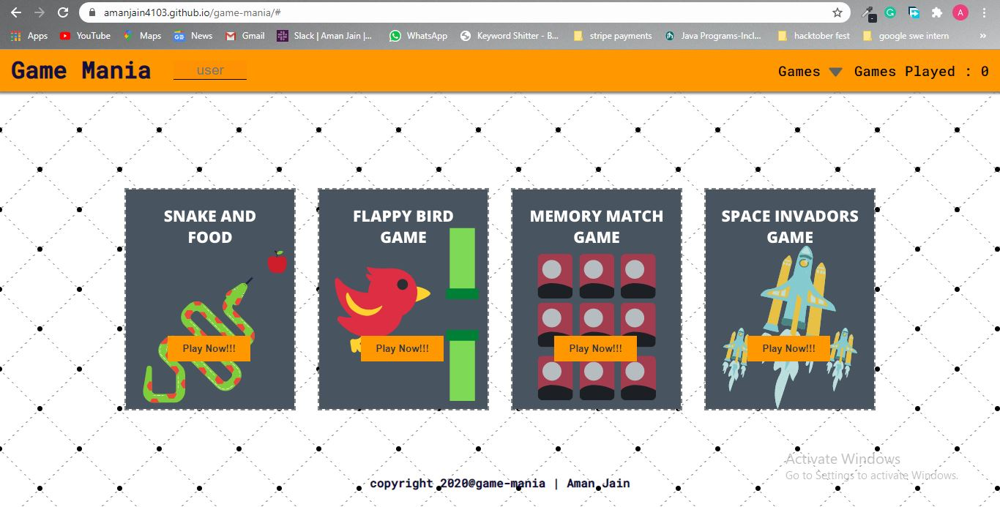
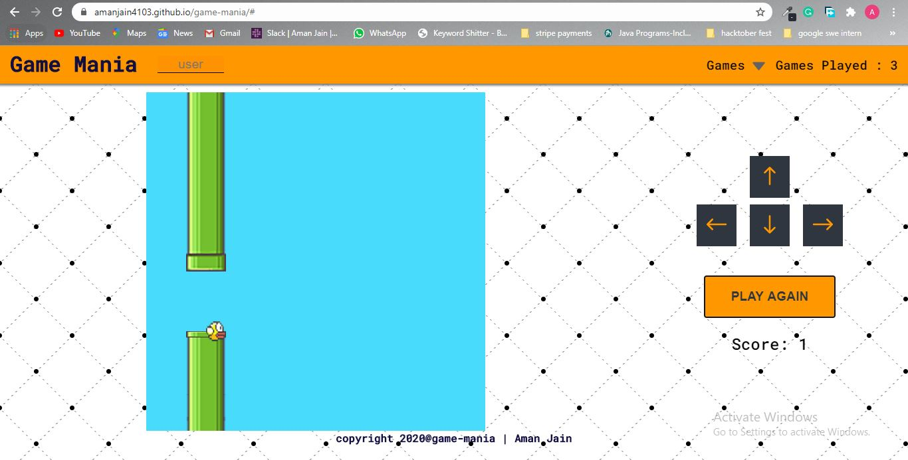
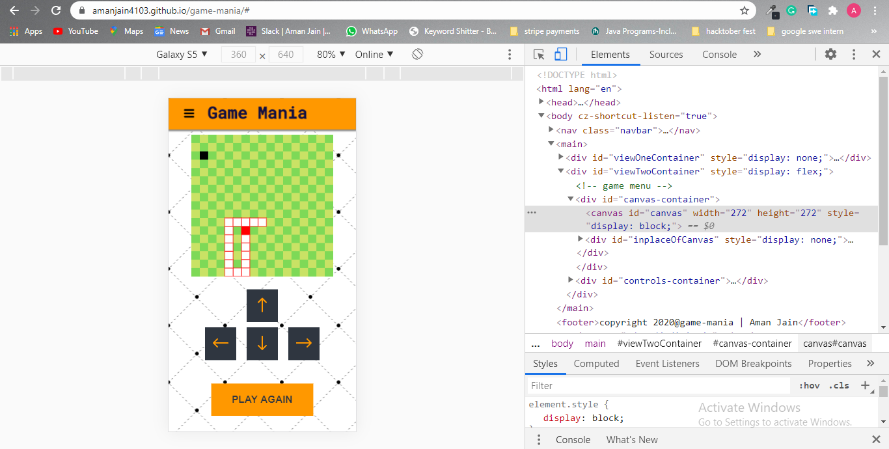

# game-mania
                                                                         
#### What's the Motive? And what is it? 
For me Games are love and Development is passion so I thought why not wear the shoes of game developer once and at the same time improve my web development skills, and this is what happened after 4 days. I made the whole website responsive so that I can play the games even when I am travelling and just used html/css/javascript to achieve the same. This project made me super confident about my fundamentals 😎

### Feature Preview [Live On Youtube!!!](https://youtu.be/oetsic5rwQw)

### Live Preview ( [here](https://amanjain4103.github.io/game-mania/) )

### Special Features That stand out
* Pure Html/Css/Javascript used
* HTML5 Canvas for 2d games 
* Responsive and Mobile first design
* Can play with keyboard as well as buttons also
* Used canva.com for graphics designing.

### Tech Stack 
* OS: Windows 10
* Html5
* CSS3
* Javascript
* Html5 Canvas
* canva.com 

### Need a Cool Website? Have Me on Your Side!!! [LinkedIN](www.linkedin.com/in/aman-jain-dev) [Instagram](https://www.instagram.com/amanjain.dev/)
